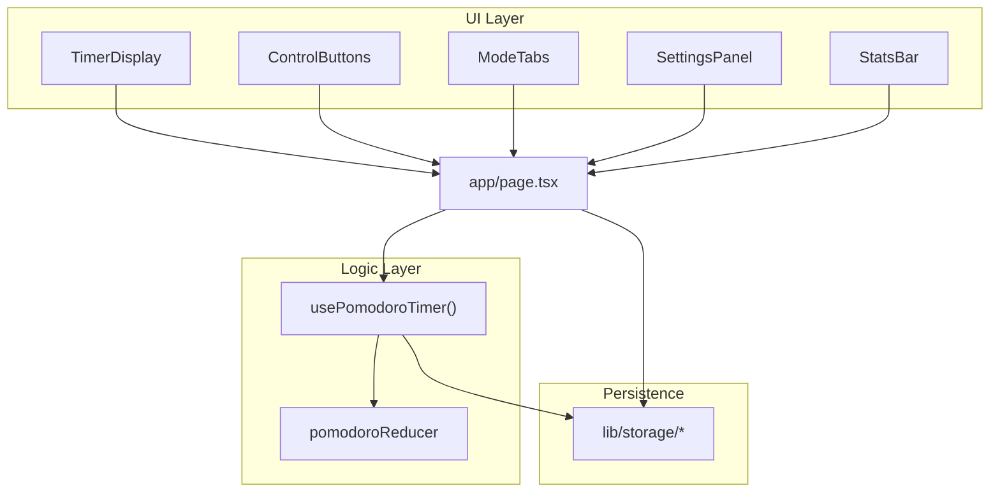

# Tomato Clock — 架構說明

## 模組圖

## 資料流

1. **掛載**：`page.tsx` 從 `loadSettings()` / `loadStats()` 讀取 localStorage，注入 `usePomodoroTimer.loadSettings` 與 React state。
2. **計時**：僅 `usePomodoroTimer` 在 `status === 'running'` 時啟動 `setInterval`，每秒 `TICK`；歸零時 reducer 執行 `applySessionComplete` 自動切換模式。
3. **work 完成**：`workCount` 增加觸發 hook 內 `onWorkComplete` → `incrementWorkSession()` 更新 stats。
4. **設定**：`SettingsPanel` 編輯 draft →「儲存設定」→ `saveSettings` + `LOAD_SETTINGS`（idle 時重算秒數）。

## 檔案邊界

| 路徑 | 職責 |
|------|------|
| `lib/pomodoro/types.ts` | 共用型別契約 |
| `lib/pomodoro/constants.ts` | 預設 25/5/15、longBreakInterval=4 |
| `lib/pomodoro/reducer.ts` | 純函式狀態機 |
| `lib/pomodoro/format.ts` | `mm:ss` 格式化 |
| `hooks/usePomodoroTimer.ts` | interval、對外 API |
| `components/**` | 展示與互動 props |
| `lib/storage/**` | SSR 安全持久化 |
| `app/page.tsx` | 組裝與 wiring |

## 狀態機

| status | 行為 |
|--------|------|
| `idle` | 顯示當前模式全長；可切換模式、重置 |
| `running` | 每秒 TICK，歸零自動切換 |
| `paused` | 保留剩餘秒數 |

模式完成規則：

- `work` 完成 → `workCount++`；若 `workCount % longBreakInterval === 0` → `longBreak`，否則 `shortBreak`
- `shortBreak` / `longBreak` 完成 → `work`；`longBreak` 後 `workCount` 歸零

## Storage Keys

- `tomato-clock:settings` — `PomodoroSettings` JSON
- `tomato-clock:stats` — `PomodoroStats` JSON；跨日重設 `todayCount`
