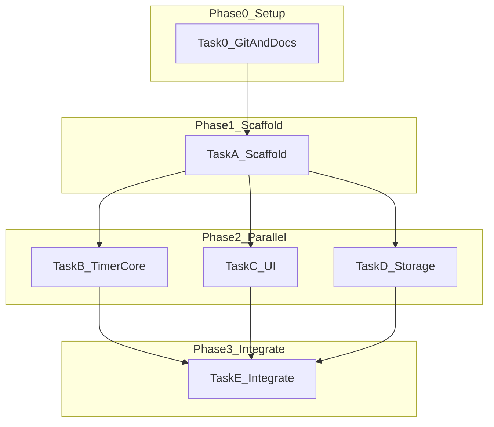

# Tomato Clock — Multi Task 操作手冊

## 1. 專案目的與 MVP 範圍

建立瀏覽器番茄鐘 Web App：三種模式（專注 / 短休 / 長休）、計時控制、localStorage 設定與統計。技術棧：Next.js App Router + React + TypeScript + Tailwind CSS。

## 2. 任務依賴圖



## 3. 啟動步驟

1. **任務 0**：`git init`、設定 `origin`、建立 `docs/` 與 `.vscode/extensions.json`
2. **任務 A**：`npx create-next-app@latest .`、型別契約、`docs/ARCHITECTURE.md`
3. **並行 B / C / D**（三個 agent 或單一 agent 依序實作）
4. **任務 E**：整合 `app/page.tsx`、`npm run build`、手動測試、push

## 4. Agent Prompt 範本

### 任務 B（計時核心）

```
在 tomato-clock 專案中實作 hooks/usePomodoroTimer.ts 與 lib/pomodoro/reducer.ts、format.ts。
僅修改 hooks/ 與 lib/pomodoro/（reducer、format），勿改 components/ 或 lib/storage/。
依 lib/pomodoro/types.ts 與 constants.ts 契約實作 START/PAUSE/RESET/TICK/COMPLETE/SET_MODE/LOAD_SETTINGS。
完成後在 docs/DEVELOPMENT_LOG.md 新增 Log #002。
```

### 任務 C（UI）

```
實作 components/timer/*、components/settings/SettingsPanel.tsx、components/stats/StatsBar.tsx。
僅修改 components/，props 依 types 契約，計時資料可用 mock。
完成後新增 Log #003。
```

### 任務 D（Storage）

```
實作 lib/storage/keys.ts、settings.ts、stats.ts，SSR 安全，跨日重設 todayCount。
僅修改 lib/storage/。完成後新增 Log #004。
```

### 任務 E（整合）

```
整合 app/page.tsx，掛載 storage 與 hook，npm run build，填手動測試清單，Log #005，git push。
```

## 5. 檔案邊界（避免 merge 衝突）

| 任務 | 可修改路徑 | 禁止修改 |
|------|------------|----------|
| B | `hooks/`, `lib/pomodoro/reducer.ts`, `lib/pomodoro/format.ts` | `components/`, `lib/storage/` |
| C | `components/**` | `lib/pomodoro/reducer.ts`, `hooks/`, `lib/storage/` |
| D | `lib/storage/**` | `hooks/`, `components/` |
| E | `app/page.tsx`、整合 wiring、文件收尾 | 盡量不大幅改 B/C/D 內部邏輯 |

## 6. 實際執行紀錄

| 項目 | 說明 |
|------|------|
| **執行日期** | 2026-05-26 |
| **Agent 數量** | 1（單一 agent 串行執行任務 0 → A → B → C → D → E） |
| **是否並行 B/C/D** | 否（計畫原設 3 agent 並行；本次為一次跑完，無 merge 衝突） |
| **耗時觀感** | 任務 0/A 約數分鐘；`create-next-app` 安裝 ~56s；build ~12s |
| **整合踩坑** | 無重大型別衝突；`page.tsx` hydrate 需避免 SSR 讀 storage |
| **build** | `npm run build` 通過 |
| **遠端** | `git push -u origin main` → `https://github.com/chang180/tomato-clock.git` |
